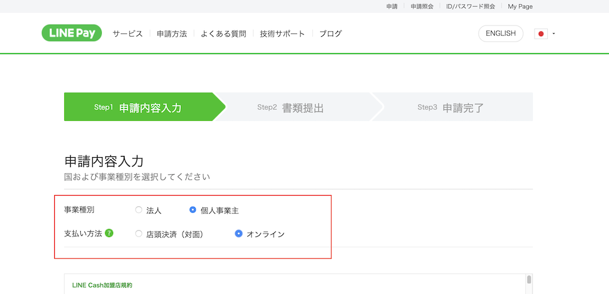
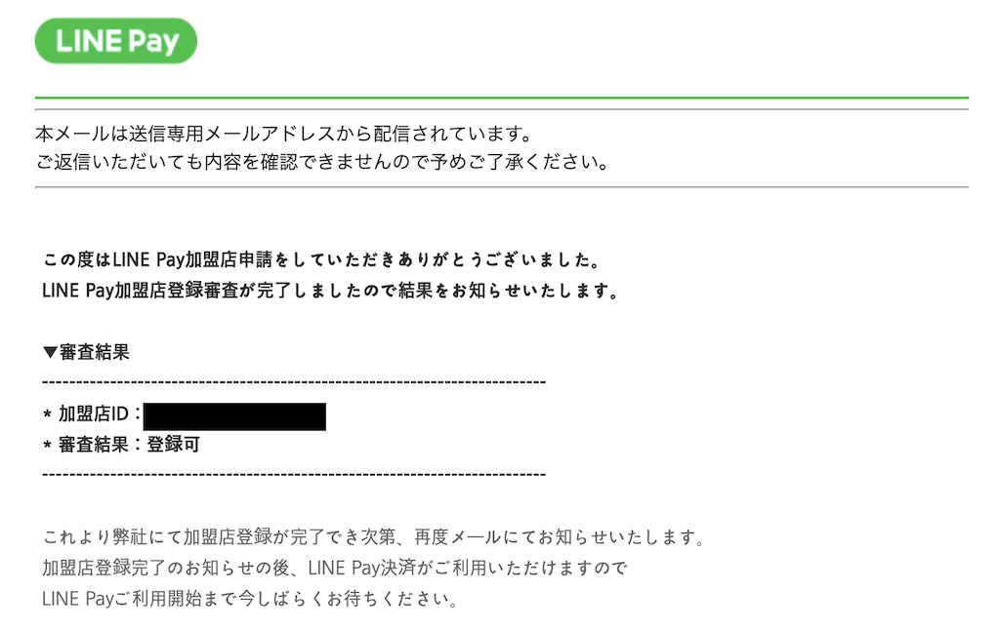
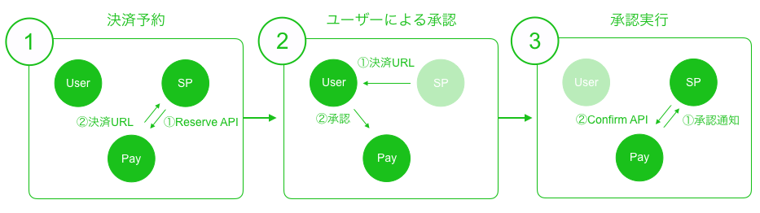
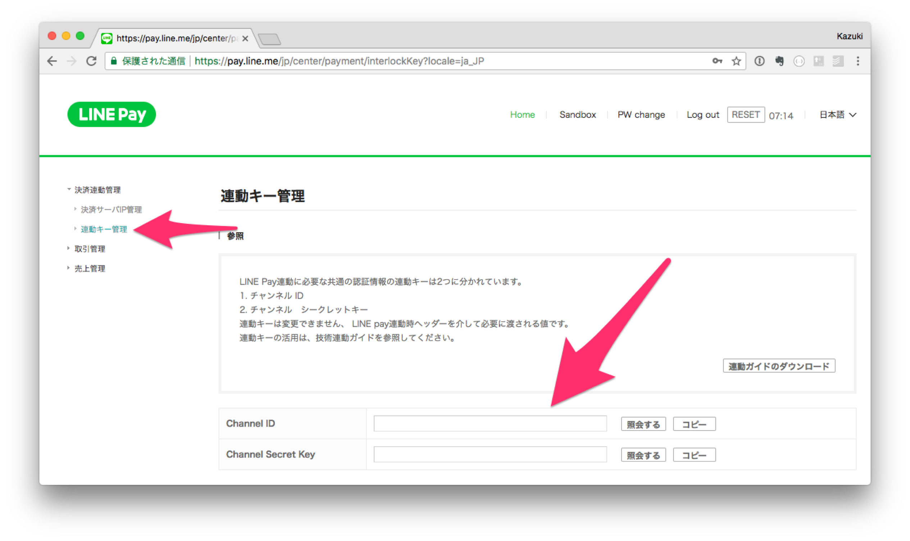
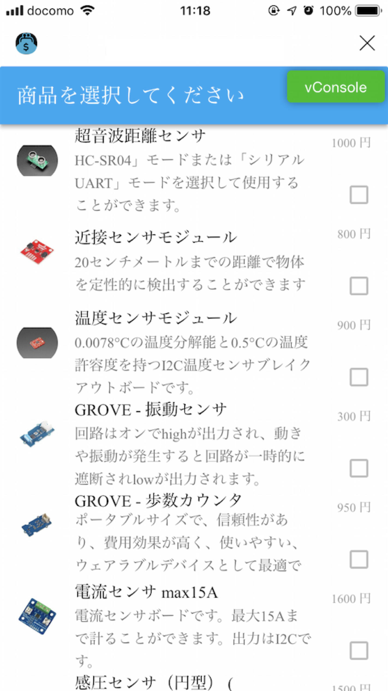
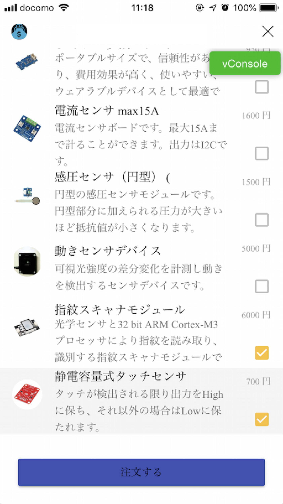
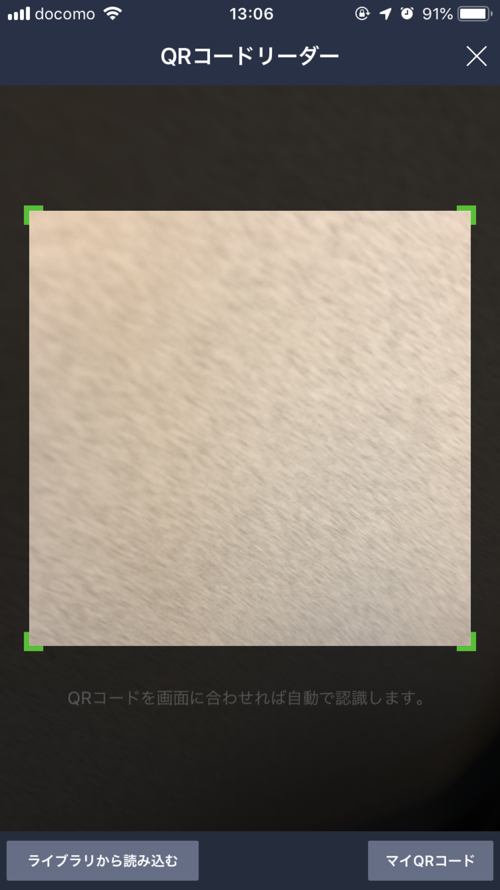
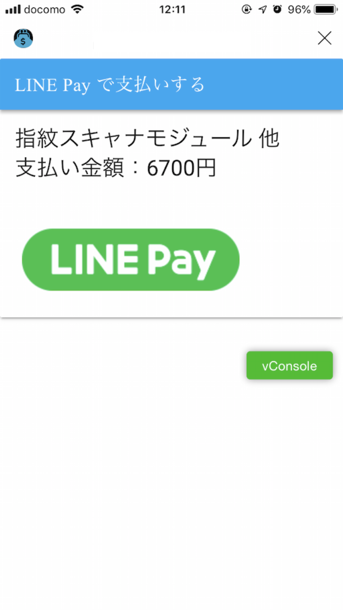
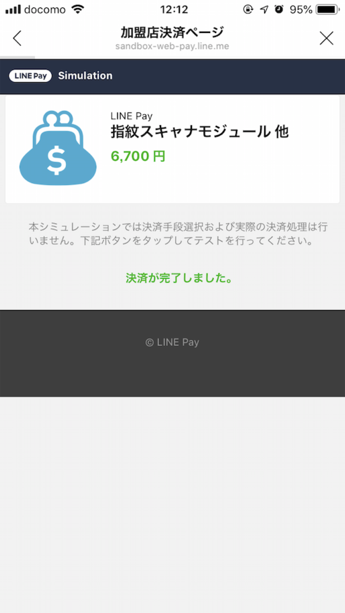

# LINE Pay API を使って決済に対応したBot を開発する

最近は『○○Pay』 がたくさん登場し、いよいよキャッシュレス決済時代が到来しそうな勢いです。

キャッシュレス決済が一般に認知され、決済のAPI が公開されているのであれば、我々個人開発者も自分のサービスに決済機能を付けて、一儲けとまでは行かなくても運用費＋お小遣いくらいは稼げるのではないか、ということでAPI が公開されているLINE Pay API を個人開発のLINE Bot に組み込んでみました。

## どんなBot か？

地元で子ども向けのプログラミング教室を個人運営しています。

単発のイベントの場合、受付で当日の参加費を頂くのですが、個人で運営しているので受付と参加費の受け取りとお釣りを返す作業が非常に面倒です。
参加費も大体が500円／回とワンコインということもあり1000円札で支払いされる方も多く、事前にお釣りを用意しておくことも地味に面倒です…

また、参加者の保護者も未就学児の小さなお子さんを連れているケースも多いのでお釣りをもらうのも手間であったりしますし、中にはお釣りが出ないようにと硬貨を事前準備される方も多いので、その負担もあります。

そんなところから、参加者にキャッシュレス決済してもらえれば、先方も現金を用意する手間が省け、運営側も参加登録と現金授受がスムーズに出来ると考え、イベントの受付や小規模な物販などで利用できるBot を開発しています。

今回は小規模な物販をイメージしたBot をサンプル実装してみました。
イベントの参加者管理＆決済であれば、商品の代わりに参加者と参加費を登録すれば対応できる思います。

なお、今回記事に掲載する内容はLINE Pay API を使った実装の解説を主眼にしたサンプル実装です。
実際のサービスとしてリリースするには、商品の在庫管理や認証や認可などに関する考慮・実装が必要となりますので、ご承知おきください。

### Bot を利用した決済までの流れ

ストア運営者と購入者（LINE Pay で決済する人）で同じBot を使います。（ストア運営者と購入者では使える機能が異なる）

1. ストア運営者がBot で販売する商品や参加者を選択する
2. ストア運営者のBot に商品に応じたQRコードを表示する
3. 購入者はBotのリッチメニューから、ストア運営者のQRコードリーダーを起動して、QRコードを読み込む
4. LINE Pay 決済画面で内容を確認して決済を実行する

## LINE Pay 導入までの流れ

LINE Pay を導入するための作業は以下のとおりです。

1. 加盟店申請
2. LINE Pay Sandbox での開発
3. 本番設定＆リリース

今回は、これらのうち「1. 加盟店申請」と「2. LINE Pay Sandbox での開発」を中心に説明します。

### LINE Pay の加盟店申請

#### 個人でも加盟店申請できる

LINE Pay の加盟店になるには法人でなくとも大丈夫です。個人で加盟店申請するには、個人事業主として開業届を出して青色申告をしてあればOKです。
LINE Pay 公式の「よくある質問」にも、個人事業主でも加入できると書いてあります。

[個人事業主も加入できますか？：よくある質問＠LINE Pay](https://pay.line.me/jp/intro/faq?locale=ja_JP&sequences=14)

加盟店申請とは関係ないですが、青色申告をしていれば、していない場合（白色申告）に比べて所得の控除額が大きく、減価償却の特例が受けられる（30万円未満の固定資産を一括償却できる。上限あり）など税金面での優遇がありますので、副業などをしている方は青色申告しておくのをお勧めします。

#### 青色申告するには

本記事はIT技術記事なので細かいことは書きませんが、開業届と青色申告承認申請書のフォーマットに沿って記載して、所管の税務署に提出するだけです。
申告書類を簡単に作成できるサービスもたくさんあるので、検索してみてください。

#### LINE Pay 加盟店申請に必要な書類など

いよいよLINE Pay 加盟店申請ですが、個人で申請する際に必要な書類などがあるので揃えておきましょう。

- 開業届または確定申告書の控え
- 本人確認書類（運転免許証など）
  - 運転免許証の場合、「運転免許証：変更事項があれば裏面含みます」と記載されていますが、裏面に記載がなくても裏表の提出が求められたので注意してください。
- Web サイト

特別なものはありませんね。それではいよいよ加盟店申請です。


[LINE Pay 加盟店申請ページ](https://pay.line.me/jp/intro?locale=ja_JP)ページ（リンク先の右上赤枠部分）にアクセスしてください。


#### 加盟店申請

個人でLINE Pay API を使う加盟店申請を行うのであれば、申請画面で以下のように選択して申請を進めます。

- 事業種別：個人事業主
- 支払い方法：オンライン



あとは、規約を読んで同意し、必要書類をスキャンしてPDF 形式などにして、スキャンしたファイルを申請ページから必要事項の記入とともにアップロードするだけです。

#### 審査と登録完了通知

申請書類の不備などが二度ありましたが、約2週間で審査完了しました。審査がスムーズなのも時間がない個人としては嬉しいところです。

審査が完了すると、下のようなメールが届きます。



## LINE Pay APIを使った決済の流れ

3つの登場人物が存在します。一つ目は **サービスプロバイダー** です。これは有償で商品またはサービスを提供する事業主（おそらくあなた）で、実質的に何らかのアプリとなります。二つ目は その商品またはサービスを購入する **ユーザー** です。そして三つ目は **LINE Pay**です。サービスプロバイダーはLINE PayのAPIに、ユーザーはLINE Payのアプリにアクセスして下記の流れで決済をおこなうことになります。


- SP = サービスプロバイダー


#### 決済予約

サービスプロバイダーは商品、金額など決済情報を決済予約のAPI（Reserve API）に送信し、決済URLを取得します。

#### ユーザーによる承認

取得した決済URLをユーザーに提供し、ユーザーが決済URLに進みます。LINE Payが起動して商品と金額が表示され、ユーザーはその情報を確認の上、決済承認をおこないます。

#### 決済実行

ユーザーが承認すると、任意のURLへのリダイレクトまたは任意のURLへのPOSTリクエストにてサービスプロバイダーに通知されます。その時点で決済を実行できる状態となっていますので、あとは決済実行のAPI（Confirm API）にアクセスすれば決済完了となります。


### システム構成

ここまでは事務的な作業でしたが、ココから本筋の開発に関する内容です。

まずはシステム構成から。

#### サーバー

- heroku
    - Docker
    - Python
        - Flask
        - SQL Alchemy 
        - Requests
    - Heroku Postgres
        - heroku のアドオン。無料枠あり
    - QuotaGuard Static
        - heroku のアドオン。無料枠あり
        - 固定IPで外部アクセスするためのプロキシ
            - LINE Pay API アクセス時に固定IPアドレスが必要なため
            - LINE Pay API Sandbox 環境では不要
- LINE Messaging API
    - LINE Messaging API 用SDK
        - [line-bot-sdk-python](https://github.com/line/line-bot-sdk-python)
- LINE Pay API
    - [Sandbox 環境](https://pay.line.me/jp/developers/techsupport/sandbox/creation?locale=ja_JP)


#### フロント

- Vue.js
    - Vuetify
        - Vue.js でマテリアルデザインのコンポーネントを簡単に使えるコンポーネントフレームワーク
    - vue-qriously
        - Vue.js でQRコードを表示するライブラリ

### LINE Pay Sandboxの申請と設定

実際に決済するには加盟店登録が必要ですが、開発して動作を確認するフェーズであればSandboxが利用できます。こちらは下記のURLから申請すると払い出されるLINE Pay API用のアカウントで、誰でもすぐに利用できます。

https://pay.line.me/jp/developers/techsupport/sandbox/creation?locale=ja_JP

アカウントが払い出されたらLINE Payコンソールの決済連動管理 > 連動キー管理からChannel IDとChannel Secret Keyを確認します。これらの値はLINE PayのAPIコールに必要になります。



### 開発

#### サーバー（heroku）の準備

##### heroku CLI のインストール

[heroku](https://jp.heroku.com/) に登録し、ターミナルなどのCLI から操作できるheroku CLI をインストールします。
Mac で開発する場合はbrew を使ってインストールできます。

```bash
$ brew tap heroku/brew && brew install heroku
```

##### アプリケーションの作成

ここからheroku CLI を使ってアプリケーションの登録などをしていきます。

まずはログイン。ログインコマンドを入力すると、ブラウザでheroku のログインページが表示されるのでこちらからログインします。

```bash
$ heroku login
heroku: Press any key to open up the browser to login or q to exit: 
Opening browser to https://cli-auth.heroku.com/auth/browser/xxxxxxxxx
Logging in... done
Logged in as xxxx@xxxx.com
```

続けてアプリケーションを作成します。

- YOUR_APP_NAME にはheroku 全体で一意となるアプリケーション名を指定します。

```bash
$ heroku create {YOUR_APP_NAME}
Creating ⬢ {YOUR_APP_NAME}... done
https://{YOUR_APP_NAME}.herokuapp.com/ | https://git.heroku.com/{YOUR_APP_NAME}.git
```

##### データベースの登録

heroku CLI で登録します。

```bash
$ heroku addons:create heroku-postgresql:hobby-dev -a {YOUR_APP_NAME}
Creating heroku-postgresql:hobby-dev on ⬢ {YOUR_APP_NAME}... free
Database has been created and is available
 ! This database is empty. If upgrading, you can transfer
 ! data from another database with pg:copy
Created postgresql-reticulated-xxxxx as DATABASE_URL
Use heroku addons:docs heroku-postgresql to view documentation
```


##### 固定IPでのアクセス用プロキシの登録

heroku CLI で登録します。

```bash
$ heroku addons:create quotaguardstatic:starter -a {YOUR_APP_NAME}
Creating quotaguardstatic:starter on ⬢ {YOUR_APP_NAME}... free
Your static IPs are [xx.xxx.xx.xx, xxx.xxx.xxx.xxx]
Created quotaguardstatic-clean-xxxxx as QUOTAGUARDSTATIC_URL
Use heroku addons:docs quotaguardstatic to view documentation
```

環境変数「QUOTAGUARDSTATIC_URL」にプロキシの設定が自動で設定されます。


#### コンテナの準備

今回はheroku にはDocker を使ってコンテナでデプロイします。こちらの記事を参考にさせていただきました。

- [FlaskアプリケーションをHeroku上のDockerで起動](https://qiita.com/nanakenashi/items/d3572989d76a651262b5)
- [Heroku で Docker を使う場合の諸注意](https://qiita.com/sho7650/items/9654377a8fc2d4db236d)


##### Dockerfile

コンテナのビルド時に以下のことをやっています。

- Python からPostgreSQL を使うために関連のモジュールをインストール
- 「requirements.txt」に記載したPython プログラムで使うライブラリをインストール
- プログラムのコードもコンテナ内にコピー

```
FROM python:3.6-alpine

RUN apk update && apk add postgresql-dev gcc python3-dev musl-dev

# make working dir
RUN mkdir -p /app

# Install dependencies
ADD requirements.txt /tmp
RUN pip install --no-cache-dir -q -r /tmp/requirements.txt

# Add app code
ADD ./app /app
WORKDIR /app

# Run the app.  CMD is required to run on Heroku
ENV FLASK_APP /app/main.py
CMD flask run -h 0.0.0.0 -p $PORT
```

##### requirements.txt

Python プログラムで使うライブラリはrequirements.txt に定義します。

データベース（PostgreSQL）へのアクセス用に「psycopg2」、ORマッパーとして「SQLAlchemy」を使っています。

LINE Pay API への接続には「requests」を利用します。

```
flask
SQLAlchemy
flask_sqlalchemy
Jinja2
psycopg2
requests
line-bot-sdk
```

#### ストア運営者が利用する機能・画面

ストア運営者が利用する商品選択〜決済用QRコード表示〜決済確認の画面・機能です。簡単に言うと店舗にあるレジの役割です。

##### 商品選択画面

ストア運営者が操作する商品選択画面です。

商品選択画面はVue.js で作成しています。今回の解説では画面数も少ないのでコンポーネント化はせずに、HTMLベースで作っています。また、この画面をLIFF として登録しておきます。

この画面で出来ることは以下のとおりです。

- 商品一覧を表示して選択する
- 注文登録後は購入者が読み取るQRコード（後述する決済開始画面のLIFF URL＋注文番号）を表示する
- 購入者が決済完了したかを確認する（追加実装予定）

###### 画面表示

ここではFlask のテンプレートエンジン（Jinja2）で商品選択画面のHTML ファイル（purchase_order.html）を返します。

```python
@app.route('/purchase_order', methods=['GET'])
def get_purchase_order():
    return render_template(
        'purchase_order.html'
    )
```

###### HTML（purchase_order.html）

QRコードの表示には、Vue.js 用のQRコード関連ライブラリ「vue-qriously」を使っています。とても簡単にQRコードを表示できるので色んな場面で使えそうです。

```html
<!DOCTYPE html>
<html>
<head>
    <script src="https://d.line-scdn.net/liff/1.0/sdk.js"></script>
    <link href="https://fonts.googleapis.com/css?family=Roboto:100,300,400,500,700,900|Material+Icons" rel="stylesheet">
    <link href="https://cdn.jsdelivr.net/npm/vuetify/dist/vuetify.min.css" rel="stylesheet">
    <meta name="viewport" content="width=device-width, initial-scale=1, maximum-scale=1, user-scalable=no, minimal-ui">
    <link rel="stylesheet" href="{{ url_for('static', filename='style.css') }}">
</head>
<body>
    <div id="app">
        <template id="purchase_order">
            <v-layout row>
<!--    API is loading...     -->
                <v-container fluid v-if="api_loading === true">
                    <v-layout >
                        <v-flex xs12>
                            <div class="resultContainer" >
                                <v-layout align-center justify-center fill-height>
                                    <v-progress-circular
                                            :size="70"
                                            :width="7"
                                            color="green"
                                            indeterminate
                                    ></v-progress-circular>
                                </v-layout>
                            </div>
                        </v-flex>
                    </v-layout>
                </v-container>
<!--    show QR-code for order     -->
                <v-flex v-else-if="payment_transaction_done === false && order_id != null"
                        xs12 sm6 offset-sm3
                >
                    <v-card>
                        <v-toolbar color="light-blue" dark>
                            <v-toolbar-title>決済用QRコード</v-toolbar-title>
                        </v-toolbar>
                        <v-card-title primary-title>
                            <div class="center">
                                <qriously :value="'line://app/<LIFF_ID>?oid=' + order_id" :size="200" class="center" />
                            </div>
                        </v-card-title>
                        <v-card-text>
                            <div class="center">
                                <h3 class="headline mb-0">[[ order_title ]]</h3>
                                <h4 class="headline mb-0">支払い金額：[[ order_amount ]]円</h4>
                            </div>
                        </v-card-text>
                        <v-card-actions>
                            <v-container fill-height fluid>
                                <v-btn
                                        @click=""
                                        block
                                        :loading="api_loading"
                                        :disabled="payment_transaction_done === true"
                                        color="indigo"
                                        class="center"
                                >
                                    決済を確認する
                                </v-btn>
                            </v-container>
                        </v-card-actions>
                    </v-card>
                </v-flex>
<!--    show done button     -->
                <v-flex v-else-if="payment_transaction_done === true && order_id != null"
                        xs12 sm6 offset-sm3
                >
                    <v-card>
                        <v-toolbar color="light-blue" dark>
                            <v-toolbar-title>決済が完了しました</v-toolbar-title>
                        </v-toolbar>
                        <v-card-actions>
                            <v-container fill-height fluid>
                                <v-btn
                                        @click="closeLiffWindow"
                                        block
                                        :loading="api_loading"
                                        color="indigo"
                                        class="center"
                                >
                                    完了
                                </v-btn>
                            </v-container>
                        </v-card-actions>
                    </v-card>
                </v-flex>
<!--    collect order items     -->
                <v-flex v-else
                        xs12 sm6 offset-sm3
                >
                    <v-card>
                        <v-toolbar color="light-blue" dark>
                            <v-toolbar-title>商品を選択してください</v-toolbar-title>
                        </v-toolbar>
                        <v-list
                                subheader
                                three-line
                        >
                            <v-list-tile
                                    v-for="(item, index) in items"
                                    :key="item.title"
                                    avatar
                                    @click="toggle_order_items(index)"
                            >
                                <v-list-tile-avatar>
                                    
                                </v-list-tile-avatar>

                                <v-list-tile-content>
                                    <v-list-tile-title v-text="item.name"></v-list-tile-title>
                                    <v-list-tile-sub-title>[[ item.description ]]</v-list-tile-sub-title>
                                </v-list-tile-content>

                                <v-list-tile-action>
                                    <v-list-tile-action-text>[[ item.unit_price ]] 円</v-list-tile-action-text>
                                    <v-icon
                                            v-if="order_items.indexOf(index) < 0"
                                            color="grey lighten-1"
                                    >
                                        check_box_outline_blank
                                    </v-icon>

                                    <v-icon
                                            v-else
                                            color="yellow darken-2"
                                    >
                                        check_box
                                    </v-icon>
                                </v-list-tile-action>
                                <v-divider></v-divider>
                            </v-list-tile>
                        </v-list>
                        <v-card-actions>
                            <v-container fill-height fluid>
                                <v-btn
                                        @click="orderPurchaseItems()"
                                        block
                                        :loading="api_loading"
                                        :disabled="order_items.length === 0"
                                        color="indigo"
                                        class="center">
                                    注文する
                                </v-btn>
                            </v-container>
                        </v-card-actions>
                    </v-card>
                </v-flex>
            </v-layout>
        </template>
    </div>
    <script src="https://cdn.jsdelivr.net/npm/vue/dist/vue.js"></script>
    <script src="https://cdn.jsdelivr.net/npm/vuetify/dist/vuetify.js"></script>
    <script src="https://unpkg.com/axios/dist/axios.min.js"></script>
    <script src="{{ url_for('static', filename='vconsole.min.js') }}"></script>
    <script src="{{ url_for('static', filename='purchase_order.js') }}"></script>
    <script src="{{ url_for('static', filename='vue-qriously.js') }}"></script>
</body>
</html>
```

###### JavaScript（purchase_order.js）

axios を使ってサーバーサイドのAPIの実行したり、商品選択用トグル機能を提供したりしています。

```javascript
  async getItems() {
      // 商品取得
      this.api_loading = true
      const api_url = '/api/items'
      const response = await axios.get(api_url).catch(error => {
          console.error('API getItems failed...')
          console.error(error)
          this.api_result = null
          this.api_loading = false
      })
      console.log('API response: ', response)
      this.api_loading = false
      this.api_result = response.data
      this.items = this.api_result.items
  },
  toggle_order_items (index) {
      // 商品選択
      const i = this.order_items.indexOf(index)
      if (i > -1) {
          this.order_items.splice(i, 1)
      } else {
          this.order_items.push(index)
      }
  },
  async orderPurchaseItems() {
      // 注文登録
      this.api_loading = true
      // collect order items
      let order_item_ids = []
      for (let i = 0; i < this.order_items.length; i++) {
          let item_index = this.order_items[i]
          let item = this.items[item_index]
          order_item_ids.push(item['id'])
      }
      // Order!
      const params = {
          user_id: this.line_user_id,
          order_items: order_item_ids
      }
      const url = '/api/purchase_order'
      console.log('API URL:', url)
      const response = await axios.post(url, params).catch(function (err) {
          this.api_loading = false
          console.error('API POST orderPurchaseItems failed', err)
          throw err
      })
      this.api_loading = false
      console.log('Response: ', response)
      this.api_result = response.data
      this.order_id = this.api_result.order_id
      this.order_title = this.api_result.order_title
      this.order_amount = this.api_result.order_amount
      this.payment_transaction_done = false
},

```

ちなみに、LIFF 開発でデバッグなどに利用できる便利なツール「vConsole」があります。導入方法などは[こちら](https://qiita.com/sumihiro3/items/9f4f1adb5d8883d9ceeb)の記事を参照してください。


##### 商品情報取得API

テンプレートだけでは商品情報を表示できないので、別途商品情報をフロントから取得するAPIを設けます。

SQLAlchemy を使ってデータベースから商品情報を取得して返しています。

```python
@app.route('/api/items', methods=['GET'])
def get_items():
    item_list = Item.query.filter(Item.active == True).all()
    items = []
    for i in item_list:
        item = {
            'id': i.id,
            'name': i.name,
            'description': i.description,
            'unit_price': i.unit_price,
            'stock': i.stock,
            'image_url': i.image_url
        }
        items.append(item)
    # return items
    return jsonify({
        'items': items
    })
```


##### 注文受付API

商品選択画面で選択された商品を基に注文情報を生成してデータベースに登録します。

なお、LINE Pay での決済では注文IDが重複不可のため、一意なIDを生成しておく必要があります。

```python
@app.route('/api/purchase_order', methods=['POST'])
def post_purchase_order():
    request_dict = request.json
    order_items = request_dict.get('order_items', [])
    order_item_list = Item.query.filter(Item.id.in_(order_items))
    # order!
    order = add_purchase_order(order_item_list)
    # return order
    return jsonify({
        'order_id': order.id,
        'order_title': order.title,
        'order_amount': order.amount
    })


def add_purchase_order(order_items):
    """
    注文情報を生成する
    :param order_items:
    :type order_items: list
    :return: purchase order
    :rtype: PurchaseOrder
    """
    # 一意な注文IDを生成
    order_id = uuid.uuid4().hex
    timestamp = int(dt.now().timestamp())
    details = []
    amount = 0
    for item in order_items:
        detail = PurchaseOrderDetail()
        detail.id = order_id + '-' + item.id
        detail.unit_price = item.unit_price
        detail.quantity = 1
        detail.amount = item.unit_price * detail.quantity
        detail.item = item
        detail.created_timestamp = timestamp
        db.session.add(detail)
        details.append(detail)
        amount = amount + detail.amount
    # generate PurchaseOrder
    order_title = details[0].item.name
    if len(details) > 1:
        order_title = '{} 他'.format(order_title)
    order = PurchaseOrder(order_id, order_title, amount)
    order.details.extend(details)
    db.session.add(order)
    db.session.commit()
    return order
```

##### 実装した商品選択画面

画像のように商品を選択して注文するボタンが配置された画面となります。





注文を登録すると決済用のQRコードが表示されるようになっています。


#### 購入者が利用する機能・画面

購入者が利用する決済用QRコード読み取り〜決済画面・機能です。LINE Pay のアプリを立ち上げて決済するような感じですね。

##### QRコードリーダー画面

QRコードリーダー画面は自前で実装しません。LINE のURLスキームから呼び出すことができます。リッチメニューのリンクに下記のURLを登録するだけでOKです。

*line://nv/QRCodeReader*

このようにアプリでよく使う機能がURLスキームとして準備されているので、実装の手間が省けてコンテンツの作成に集中できるのも有り難いです。




##### 決済開始画面

購入者が操作する決済画面です。こちらもLIFFとして登録しておきます。

こちらもVue.js で作成しています。この画面で出来ることは以下のとおりです。

- 決済内容を確認して決済を開始する
- LINE Pay 側にリダイレクトし、決済を実施する

###### 画面表示

ここではFlask のテンプレートエンジン（Jinja2）で決済開始画面のHTML ファイル（pay_by_line_pay.html）を返します。

```python
@app.route('/pay_by_line_pay', methods=['GET'])
def get_pay_by_line_pay():
    return render_template(
        'pay_by_line_pay.html'
    )

```

###### HTML（pay_by_line_pay.html）

決済内容と決済を介するボタンを表示しています。

```html
<!DOCTYPE html>
<html>
<head>
    <script src="https://d.line-scdn.net/liff/1.0/sdk.js"></script>
    <link href="https://fonts.googleapis.com/css?family=Roboto:100,300,400,500,700,900|Material+Icons" rel="stylesheet">
    <link href="https://cdn.jsdelivr.net/npm/vuetify/dist/vuetify.min.css" rel="stylesheet">
    <meta name="viewport" content="width=device-width, initial-scale=1, maximum-scale=1, user-scalable=no, minimal-ui">
    <link rel="stylesheet" href="{{ url_for('static', filename='style.css') }}">
</head>
<body>
    <div id="app">
        <template id="purchase_order">
            <v-layout row>
<!--    API is loading...     -->
                <v-container fluid v-if="api_loading === true">
                    <v-layout >
                        <v-flex xs12>
                            <div class="resultContainer" >
                                <v-layout align-center justify-center fill-height>
                                    <v-progress-circular
                                            :size="70"
                                            :width="7"
                                            color="green"
                                            indeterminate
                                    ></v-progress-circular>
                                </v-layout>
                            </div>
                        </v-flex>
                    </v-layout>
                </v-container>
<!--    show LINE Pay button     -->
                <v-flex v-else-if="order_id != null && this.order.id != null && payment_transaction_done === false"
                        xs12 sm6 offset-sm3
                >
                    <v-card>
                        <v-toolbar color="light-blue" dark>
                            <v-toolbar-title>LINE Pay で支払いする</v-toolbar-title>
                        </v-toolbar>
                        <v-card-text>
                            <div class="center">
                                <h3 class="headline mb-0">[[ order.title ]]</h3>
                                <h4 class="headline mb-0">支払い金額：[[ order.amount ]]円</h4>
                            </div>
                        </v-card-text>
                        <v-card-actions>
                            <v-container fill-height fluid>
                                <form action="/pay/reserve" method="post">
                                    <input type="hidden" name="order_id" :value="order_id" />
                                    <input type="hidden" name="user_id" :value="line_user_id" />
                                    <button type="submit">
                                        
                                    </button>
                                </form>
                            </v-container>
                        </v-card-actions>
                    </v-card>
                </v-flex>
<!--    other     -->
                <v-flex v-else
                        xs12 sm6 offset-sm3
                >
                    <v-card>
                        <v-toolbar color="light-blue" dark>
                            <v-toolbar-title>ERROR...</v-toolbar-title>
                        </v-toolbar>
                    </v-card>
                </v-flex>
            </v-layout>
        </template>
    </div>
    <script src="https://cdn.jsdelivr.net/npm/vue/dist/vue.js"></script>
    <script src="https://unpkg.com/vue-router"></script>
    <script src="https://cdn.jsdelivr.net/npm/vuetify/dist/vuetify.js"></script>
    <script src="https://unpkg.com/axios/dist/axios.min.js"></script>
    <script src="{{ url_for('static', filename='vconsole.min.js') }}"></script>
    <script src="{{ url_for('static', filename='pay_by_line_pay.js') }}"></script>
</body>
</html>

```

###### JavaScript（pay_by_line_pay.js）

axios を使って決済処理中の注文情報を取得する機能を実装しています。

```javascript
          async getPurchaseOrder() {
            console.log('getPurchaseOrder called!!')
            // 決済処理中の注文情報を 取得
            this.api_loading = true
            this.order_id = this.$route.query.oid
            console.log('order_id: ' + this.order_id)
            const api_url = '/api/order/' + this.line_user_id + '/' + this.order_id
            const response = await axios.get(api_url).catch(error => {
                console.error('API getPurchaseOrder failed...')
                console.error(error)
                this.api_result = null
                this.api_loading = false
            })
            console.log('API response: ', response)
            this.api_loading = false
            this.api_result = response.data
            this.order = this.api_result.order
        },
```

##### 注文情報取得API

注文情報をフロントから取得するAPIを設けます。

SQLAlchemy を使ってデータベースから注文情報を取得して返しています。

```python
@app.route('/api/order/<user_id>/<order_id>', methods=['GET'])
def get_order_info(user_id, order_id):
    # query order
    order = PurchaseOrder.query.filter(PurchaseOrder.id == order_id).first()
    return jsonify({
        'order': {
            'id': order.id,
            'title': order.title,
            'amount': order.amount
        }
    })
```

##### 実装した決済開始画面

画像のように商品選択画面で登録した注文情報が表示され、LINE Pay で決済予約処理を実行するボタンが配置された画面となります。




##### 決済予約処理の実行

商品、金額など決済情報を決済予約のAPI（Reserve API）に送信し、決済URLを取得する処理を実行します。

LINE Pay の決済予約API を実行して、返ってくるトランザクションID とユーザーを注文情報に結び付け、決済承認画面にリダイレクトしています。

```python
@app.route("/pay/reserve", methods=['POST'])
def handle_pay_reserve():
    order_id = request.form.get('order_id', None)
    user_id = request.form.get('user_id', None)
    # get PurchaseOrder and User
    order = PurchaseOrder.query.filter(PurchaseOrder.id==order_id).first()
    user = User.query.filter(User.id==user_id).first()
		# do reserve payment
    response = pay.reserve_payment(order)
    app.logger.debug('Response: %s', json_util.dump_json_with_pretty_format(response))
    app.logger.debug('returnCode: %s', response["returnCode"])
    app.logger.debug('returnMessage: %s', response["returnMessage"])
    transaction_id = response["info"]["transactionId"]
    app.logger.debug('transaction_id: %s', transaction_id)
    # set TransactionId and User to PurchaseOrder
    order.transaction_id = transaction_id
    order.user_id = user.id
    db.session.commit()
    db.session.close()
    # redirect to LINE Pay payment page
    redirect_url = response["info"]["paymentUrl"]["web"]
    return redirect(redirect_url)
```

###### LINE Pay API 決済予約の実行

LINE Pay API を呼び出す部分です。
決済する注文情報とAPI で設定された各種パラメータを設定して決済予約APIのURL（/v2/payments/request）へPOSTリクエストを送ります。

API のパラメータについては、[LINE Pay 技術ドキュメント]をご確認ください。(https://pay.line.me/jp/developers/documentation/download/tech?locale=ja_JP)

line_pay.py（抜粋）

```python
    def reserve_payment(
            self,
            purchase_order,
            product_image_url=LINE_PAY_BOT_LOGO_URL,
            mid=None,
            one_time_key=None,
            delivery_place_phone=None,
            pay_type='NORMAL',
            lang_cd=None,
            capture=True,
            extras_add_friends=None,
            gmextras_branch_name=None):
        line_pay_url = self.__line_pay_url
        line_pay_endpoint = f'{line_pay_url}/v2/payments/request'
        order_id = purchase_order.id
        body = {
            'productName': purchase_order.title,
            'amount': purchase_order.amount,
            'currency': purchase_order.currency,
            'confirmUrl': self.__confirm_url,
            'confirmUrlType': self.__confirm_url_type,
            'checkConfirmUrlBrowser': self.__check_confirm_url_browser,
            'orderId': order_id,
            'payType': pay_type,
            'capture': capture,
        }
        if product_image_url is not None:
            body['productImageUrl'] = product_image_url
        if mid is not None:
            body['mid'] = mid
        if one_time_key is not None:
            body['oneTimeKey'] = one_time_key
        if self.__cancel_url is not None:
            body['cancelUrl'] = self.__cancel_url
        if delivery_place_phone is not None:
            body['deliveryPlacePhone'] = delivery_place_phone
        if lang_cd is not None:
            body['langCd'] = lang_cd
        if extras_add_friends is not None:
            body['extras.addFriends'] = extras_add_friends
        if gmextras_branch_name is not None:
            body['gmextras.branchName'] = gmextras_branch_name
        # リクエスト送信
        response = requests.post(
            line_pay_endpoint,
            json_util.dump_json(body).encode('utf-8'),
            headers=self.__headers,
            proxies=self.__proxies
        )
        return response.json()
```


##### LINE Pay の決済承認画面

決済予約処理が正常に完了すると、画像のようにLINE Pay の決済承認画面が表示されます。ここはLINE Pay プラットフォーム側の画面となります。

注文情報（注文名や決済する金額）、指定した画像と決済承認ボタンが表示されています。


「PAY NOW」と表示された決済承認ボタンを押下すると決済承認処理が行われ、決済承認完了画面が表示されます。この後、開発したサービスのサーバーへ処理が返ってきます。




##### 決済実行処理の実行

LINE Pay 側からサーバーサイドの決済実行処理が呼び出されますので、決済実行API を呼び出して決済を完了させます。

決済実行API が正常に完了すれば、注文情報のステータスを決済完了にして更新します。

最後に決済完了のメッセージやページを表示させれば実装完了です。

```python
@app.route("/pay/confirm", methods=['GET'])
def handle_pay_confirm():
    transaction_id = request.args.get('transactionId')
    # find PurchaseOrder by transaction_id
    order = PurchaseOrder.query.filter_by(transaction_id=transaction_id).one_or_none()
    if order is None:
        raise Exception("Error: transaction_id not found.")
    # do confirm payment
    response = pay.confirm_payments(order)
    app.logger.debug('returnCode: %s', response["returnCode"])
    app.logger.debug('returnMessage: %s', response["returnMessage"])

    order.status = PurchaseOrderStatus.PAYMENT_COMPLETED.value
    db.session.commit()
    db.session.close()
    return "決済が完了しました"
```


###### LINE Pay API 決済実行

LINE Pay API を呼び出す部分です。
API で設定された各種パラメータを設定して決済実行APIのURL（/v2/payments/{transaction_id}/confirm）へPOSTリクエストを送ります。

API のパラメータについては、[LINE Pay 技術ドキュメント]をご確認ください。(https://pay.line.me/jp/developers/documentation/download/tech?locale=ja_JP)

```python
    def confirm_payments(self, purchase_order):
        line_pay_url = self.__line_pay_url
        line_pay_endpoint = f'{line_pay_url}/v2/payments/{purchase_order.transaction_id}/confirm'
        body = {
            'amount': purchase_order.amount,
            'currency': purchase_order.currency,
        }
        # リクエスト送信
        response = requests.post(
            line_pay_endpoint,
            json_util.dump_json(body).encode('utf-8'),
            headers=self.__headers,
            proxies=self.__proxies
        )
        return response.json()
```


#### heroku へのデプロイ

##### 環境変数の設定

デプロイの前に今回のBot サービスで使用する環境変数をheroku に登録しておきます。

###### LINE Bot のChannel Secretとアクセストークン

これらの情報はLINE Developers の画面から取得できます。

```bash
$ heroku config:set LINEBOT_CHANNEL_ACCESS_TOKEN=xxxxxxxxxxxxxxxxxxx -a {YOUR_APP_NAME}
$ heroku config:set LINEBOT_CHANNEL_SECRET=xxxxxxxxxx -a {YOUR_APP_NAME}
```


###### LINE Pay API のChannel ID など

これらの情報はLINE Pay API Sandbox の画面から取得できます。

LINE_PAY_CONFIRM_URL は、LINE Pay での決済承認後、自分のサーバーに返ってくるURLを指定します。

```bash
$ heroku config:set LINE_PAY_URL=https://sandbox-api-pay.line.me -a {YOUR_APP_NAME}
$ heroku config:set LINE_PAY_CHANNEL_ID=xxxxxxxxx -a {YOUR_APP_NAME}
$ heroku config:set LINE_PAY_CHANNEL_SECRET=xxxxxxxxxxxx -a {YOUR_APP_NAME}
$ heroku config:set LINE_PAY_CONFIRM_URL=https://{YOUR_APP_NAME}/pay/confirm -a {YOUR_APP_NAME}
```

###### psycopg2 でのアクセスで使用するデータベスURL

SQL Alchemy でのデータベース接続情報はheroku のHeroku Postgres 設定画面などで確認できます。

```bash
$ heroku config:set POSTGRESQL_DATABASE_URL=postgres+psycopg2://{DB_USER_ID}:{DB_USER_PASSWORD}@{DB_SERVER_URL}:5432/{DB_NAME} -a {YOUR_APP_NAME}
```

###### 固定IPアクセス用のプロキシURL

固定IPアクセス用のプロキシURL に関する環境変数は、QuotaGuard Static アドオン登録時に登録されますので追加設定は不要です。

##### コンテナのデプロイ

いよいよBotサービスをheroku にリリースします。

heroku のコンテナサービスにログインして、コンテナイメージをpush、heroku アプリケーションとしてリリースします。

```bash
// login to heroku container
$ heroku container:login
Login Succeeded

// push container image to heroku container
$ heroku container:push -a {YOUR_APP_NAME} web
Your image has been successfully pushed. You can now release it with the 'container:release' command.

// release application
$ heroku container:release -a {YOUR_APP_NAME} web
Releasing images web to {YOUR_APP_NAME}
```

これで完了です！

## 最後に

解説が長くなりましたが、基本的な決済機能の組み込みは以上です。
サービスとして公開するにはキャンセル処理なども実装する必要がありますが、他APIの呼び出しについても同様にAPI ドキュメントに沿ってパラメータを指定するだけです。

また、今回はBot への組み込みで解説しましたがWeb ページへの組み込みもほぼ同じですので、決済機能を組み込んで個人でも稼いでいきましょう！


## 関連リンク

- [LINE Pay APIを使ってアプリに決済を組み込む方法](https://qiita.com/nkjm/items/b4f70b4daaf343a2bedc)

- [［手続名］所得税の青色申告承認申請手続：国税庁](https://www.nta.go.jp/taxes/tetsuzuki/shinsei/annai/shinkoku/annai/09.htm)

- [LINE Pay](https://line.me/ja/pay)

    - [LINE Pay 加盟店申請](https://pay.line.me/jp/intro?locale=ja_JP)
    - [SandBox 申請](https://pay.line.me/jp/developers/techsupport/sandbox/creation?locale=ja_JP)
    - [LINE Pay 技術ドキュメント](https://pay.line.me/jp/developers/documentation/download/tech?locale=ja_JP)
    - [LINE Pay ロゴ画像](https://pay.line.me/jp/developers/documentation/download/logo?locale=ja_JP)

- LINE Messaging API
    - [line-bot-sdk-python](https://github.com/line/line-bot-sdk-python)

- [heroku](https://jp.heroku.com/)
    - [heroku CLI](https://devcenter.heroku.com/categories/command-line)
    - [Deploying with Docker](https://devcenter.heroku.com/categories/deploying-with-docker)
    - [QuotaGuard Static](https://devcenter.heroku.com/articles/quotaguardstatic)
    - [Heroku Postgres](https://devcenter.heroku.com/articles/heroku-postgresql)
    - [FlaskアプリケーションをHeroku上のDockerで起動](https://qiita.com/nanakenashi/items/d3572989d76a651262b5)
    - [Heroku で Docker を使う場合の諸注意](https://qiita.com/sho7650/items/9654377a8fc2d4db236d)

- Vue.js
    - [Vuetify](https://vuetifyjs.com/ja/)
    - [vue-qriously](https://github.com/theomessin/vue-qriously)

  
